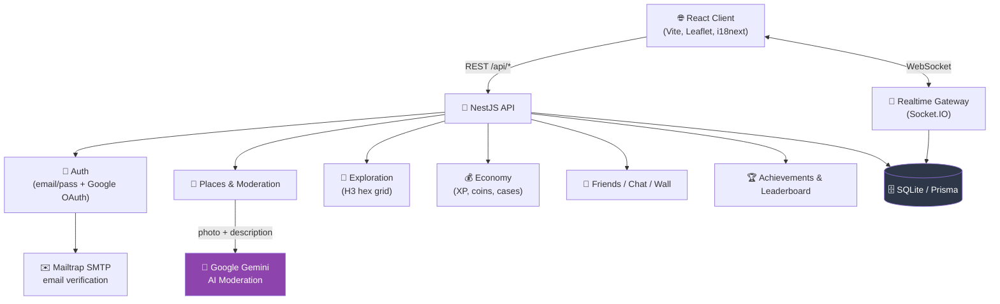

<div align="center">

# 🧭 Absolute Travel

<p><b>Social network for travelers</b> — explore the map, mark real places,<br/>earn XP and coins, compete in the leaderboard, and chat with friends in real-time.</p>


🌐 [Українська](README.md) | 🌐 [Polski](README.pl.md)

</div>

---

## 📌 About

Absolute Travel is a monorepo with a **NestJS backend** and **React + Vite frontend**:
users explore a stylized hexagonal map (H3), mark visited places with photo proof,
add their own spots to the map (with AI moderation), level up, open cases with
profile cosmetics, make friends, chat in real-time, and compete in the leaderboard.

## 🗺️ Architecture



## ✨ Main Modules

| Module | Description |
|---|---|
| 🗺️ **Travel Map** | Real geolocation of places (lat/lng), projected onto a stylized map of Ukraine |
| 🤖 **AI Moderation** | Google Gemini analyzes the photo and description of a new spot before publication |
| 🧩 **Exploration (H3)** | Exploration progress of territory using the H3 hexagonal grid |
| 💰 **Economy** | XP, levels, coins, cases with cosmetics for profile customization |
| 👥 **Social Part** | Friends, live chat (Socket.IO), profile wall, friends' markers on the map |
| 🏆 **Achievements / Leaderboard** | Achievements and traveler rankings |
| 🔐 **Auth** | Email + password (verified via Mailtrap) or Google Sign-In |
| 🛡️ **Admin Panel** | Single login form; logging in as admin opens the moderation and admin management panel |

## 🚀 Quick Start

### 💻 Local Run (without Docker)

```bash
# 1. Install all dependencies (root + backend + frontend) and prepare database
npm run install:all

# 2. Run frontend and backend simultaneously
npm run dev
```

### 🐳 Run with Docker

If you want to run the project in containers:

```bash
# 1. Build the images and run the containers in the background
docker compose up --build -d

# 2. Check the container status and healthcheck
docker compose ps

# 3. View logs
docker compose logs -f

# 4. Stop and remove containers
docker compose down
```

> ℹ️ **Default ports:** The frontend will be available at [http://localhost:8080](http://localhost:8080), and the backend at [http://localhost:3000](http://localhost:3000). You can configure host ports or pass environment variables via the root `.env` file (using `FRONTEND_PORT` and `BACKEND_PORT` variables).


<details>
<summary><b>⚙️ Configuring `.env`</b></summary>

Create a `.env` file in the root (or copy from `.env.example`):

```bash
# Google Gemini API key for AI advisor and spot moderation
GEMINI_API_KEY=""          # https://aistudio.google.com/apikey
GEMINI_MODEL="gemini-2.5-flash"

# Main (fixed) admin account — change in production
ADMIN_LOGIN="admin"
ADMIN_PASSWORD="admin123"

# Google OAuth 2.0 (Sign in with Google)
GOOGLE_CLIENT_ID=""
GOOGLE_CLIENT_SECRET=""    # https://console.cloud.google.com/apis/credentials

# SMTP for email verification (Mailtrap sandbox)
MAILTRAP_USER=""
MAILTRAP_PASS=""           # https://mailtrap.io/
```

> Without `GEMINI_API_KEY`, the application will still work: all user suggestions for new places will simply get "pending verification" status and wait for manual admin review.

</details>

<details>
<summary><b>🗂️ Repository Structure</b></summary>

```
AbsoluteTravel/
├── backend/            # NestJS API (Prisma + SQLite)
│   ├── src/
│   │   ├── auth/         # email/password + Google OAuth, email verification
│   │   ├── places/       # map places + AI moderation (Gemini)
│   │   ├── exploration/  # progress on H3 hexagons
│   │   ├── economy/      # XP, coins, cases
│   │   ├── friends/      # friend requests, map markers
│   │   ├── chat/         # real-time chat
│   │   ├── realtime/     # Socket.IO gateway
│   │   ├── achievements/ # achievements
│   │   ├── leaderboard/  # player rankings
│   │   ├── admin/        # admin management
│   │   └── wall/         # profile wall
│   └── prisma/schema.prisma
└── frontend/           # React 19 + Vite + Leaflet
    └── src/
        ├── ExploreMap.tsx, LeafletMap.tsx   # map
        ├── ChatPage.tsx, FriendsPage.tsx     # social features
        ├── ProfileShop.tsx, CaseOpener.tsx   # economy
        ├── AdminPanel.tsx                    # admin panel
        └── exploration/useExploration.ts     # client-side H3 logic
```

</details>

<details>
<summary><b>🔑 Who can add places to the map</b></summary>

- **Any user** — by clicking the "Add Place" button on the map. The submission undergoes **AI moderation** (Google Gemini, with photo analysis): appropriate places are published automatically, questionable ones go to manual review, and inappropriate ones are rejected. At least 2 photos and geolocation are required.
- **Administrator** — a special account with login and password: adds places directly (bypassing moderation), approves/rejects/deletes submissions, and **manages other administrators** (creates and deletes admin accounts).

**Single login:** the login form is the same for everyone. If you log in as an administrator, you get redirected to the admin panel. Regular users log into their standard interface with no admin features shown.

**Admin accounts:**
- **Main administrator** — single, fixed account. The login and password are loaded from `.env` (`ADMIN_LOGIN` / `ADMIN_PASSWORD`) and synchronized on every server start. It cannot be deleted through the panel.
- **Regular administrators** — created by any administrator in the "Administrators" section. They have the same moderation capabilities.

Technically, login returns a session token (header `x-admin-token`, saved in the browser). By default: login `admin`, password `admin123`.

</details>

## 🧱 Tech Stack

- **Backend:** NestJS 11, Prisma 6 (SQLite), Socket.IO, bcryptjs, Google Auth Library, Nodemailer
- **Frontend:** React 19, Vite, Leaflet, i18next (UA/EN), Socket.IO client, H3-js
- **AI:** Google Gemini — moderation of new spots and AI advisor
- **Auth:** email/password with verification via Mailtrap + Google Sign-In

## 📄 License

This project is licensed under the [MIT](LICENSE) License.
