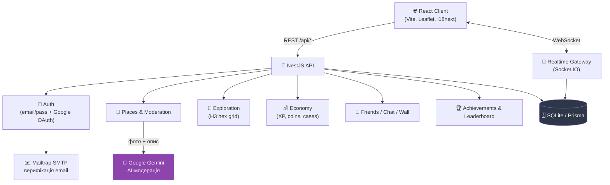

<div align="center">

# 🧭 Absolute Travel

<p><b>Соціальна мережа для мандрівників</b> — досліджуй карту, відмічай реальні місця,<br/>заробляй XP та монети, змагайся у лідерборді й спілкуйся з друзями в реальному часі.</p>


</div>

---

## 📌 Що це таке

Absolute Travel — це монорепозиторій із **NestJS-бекендом** та **React + Vite фронтендом**:
користувачі досліджують стилізовану гексагональну карту (H3), відмічають відвідані
місця з фотодоказами, додають власні точки на карту (з ШІ-модерацією), качають рівень,
відкривають кейси з косметикою для профілю, дружать, чатяться в реальному часі та
змагаються в лідерборді.

## 🗺️ Архітектура



## ✨ Основні модулі

| Модуль | Опис |
|---|---|
| 🗺️ **Карта мандрівок** | Реальна геолокація місць (lat/lng), спроєктована на стилізовану мапу України |
| 🤖 **ШІ-модерація** | Google Gemini аналізує фото та опис нової точки перед публікацією |
| 🧩 **Exploration (H3)** | Прогрес дослідження території через гексагональну сітку H3 |
| 💰 **Economy** | XP, рівні, монети, кейси з косметикою для профілю |
| 👥 **Соціальна частина** | Друзі, живий чат (Socket.IO), стіна профілю, мітки друзів на карті |
| 🏆 **Досягнення / Leaderboard** | Ачівки та рейтинг мандрівників |
| 🔐 **Auth** | Email + пароль (з верифікацією через Mailtrap) або Google Sign-In |
| 🛡️ **Адмінка** | Єдина форма входу; логін адміна відкриває панель модерації та керування адмінами |

## 🚀 Швидкий старт

### Локальний запуск (без Docker)

```bash
# 1. Встановити всі залежності (root + backend + frontend) і підготувати БД
npm run install:all

# 2. Запустити фронтенд і бекенд одночасно
npm run dev
```

### 🐳 Запуск через Docker

Якщо ви хочете запустити проєкт у контейнерах:

```bash
# 1. Зібрати образи та запустити контейнери у фоновому режимі
docker compose up --build -d

# 2. Перевірити статус контейнерів та їх здоров'я (healthcheck)
docker compose ps

# 3. Переглянути логи
docker compose logs -f

# 4. Зупинити й видалити контейнери
docker compose down
```

> ℹ️ **Порти за замовчуванням:** Фронтенд буде доступний на [http://localhost:8080](http://localhost:8080), а бекенд — на [http://localhost:3000](http://localhost:3000). Налаштувати порти хоста або передати змінні можна через кореневий файл `.env` (за допомогою змінних `FRONTEND_PORT` та `BACKEND_PORT`).


<details>
<summary><b>⚙️ Налаштування `.env`</b></summary>

Створіть `.env` у корені (або скопіюйте з `.env.example`):

```bash
# Google Gemini API key для ШІ-порадника та модерації місць
GEMINI_API_KEY=""          # https://aistudio.google.com/apikey
GEMINI_MODEL="gemini-2.5-flash"

# Головний (фіксований) адмін-акаунт — змініть у продакшені
ADMIN_LOGIN="admin"
ADMIN_PASSWORD="admin123"

# Google OAuth 2.0 (Sign in with Google)
GOOGLE_CLIENT_ID=""
GOOGLE_CLIENT_SECRET=""    # https://console.cloud.google.com/apis/credentials

# SMTP для верифікації email (Mailtrap sandbox)
MAILTRAP_USER=""
MAILTRAP_PASS=""           # https://mailtrap.io/
```

> Без `GEMINI_API_KEY` застосунок працює: усі користувацькі заявки на нові місця
> просто отримують статус «на перевірці» й чекають на адміністратора.

</details>

<details>
<summary><b>🗂️ Структура репозиторію</b></summary>

```
AbsoluteTravel/
├── backend/            # NestJS API (Prisma + SQLite)
│   ├── src/
│   │   ├── auth/         # email/пароль + Google OAuth, верифікація пошти
│   │   ├── places/       # карта місць + AI-модерація (Gemini)
│   │   ├── exploration/  # прогрес по H3-гексагонах
│   │   ├── economy/      # XP, монети, кейси
│   │   ├── friends/      # заявки в друзі, мітки на карті
│   │   ├── chat/         # реальний чат
│   │   ├── realtime/     # Socket.IO gateway
│   │   ├── achievements/ # ачівки
│   │   ├── leaderboard/  # рейтинг гравців
│   │   ├── admin/        # керування адмінами
│   │   └── wall/         # стіна профілю
│   └── prisma/schema.prisma
└── frontend/           # React 19 + Vite + Leaflet
    └── src/
        ├── ExploreMap.tsx, LeafletMap.tsx   # карта
        ├── ChatPage.tsx, FriendsPage.tsx     # соціальна частина
        ├── ProfileShop.tsx, CaseOpener.tsx   # економіка
        ├── AdminPanel.tsx                    # адмінка
        └── exploration/useExploration.ts     # H3-логіка на клієнті
```

</details>

<details>
<summary><b>🔑 Хто може додавати місця на карту</b></summary>

- **Будь-який користувач** — кнопка «Додати місце» на карті. Заявка проходить
  **ШІ-модерацію** (Google Gemini, з аналізом фото): адекватні місця публікуються
  автоматично, сумнівні — потрапляють на ручну перевірку, неприйнятні —
  відхиляються. Обов'язкові щонайменше 2 фото та геолокація.
- **Адміністратор** — окремий акаунт із логіном і паролем: додає місця напряму
  (без модерації), схвалює / відхиляє / видаляє заявки, а також **керує іншими
  адміністраторами** (створює та видаляє акаунти).

**Єдиний вхід:** форма входу одна для всіх. Якщо ввести логін і пароль
адміністратора — потрапляєш у меню адміністратора з усіма функціями вище.
Звичайний учасник потрапляє у звичайне меню без жодних згадок про адмінку.

**Адмін-акаунти:**
- **Головний адміністратор** — єдиний, фіксований акаунт. Логін і пароль
  беруться з `.env` (`ADMIN_LOGIN` / `ADMIN_PASSWORD`) і синхронізуються під час
  кожного старту сервера. Його не можна видалити через панель.
- **Звичайні адміністратори** — створюються будь-яким адміном у розділі
  «Адміністратори». Мають ті самі функції модерації.

Технічно: вхід повертає сесійний токен (заголовок `x-admin-token`, зберігається
у браузері). За замовчуванням: логін `admin`, пароль `admin123`.

</details>

## 🧱 Стек технологій

- **Backend:** NestJS 11, Prisma 6 (SQLite), Socket.IO, bcryptjs, Google Auth Library, Nodemailer
- **Frontend:** React 19, Vite, Leaflet, i18next (UA/EN), Socket.IO client, H3-js
- **AI:** Google Gemini — модерація нових місць та ШІ-порадник
- **Auth:** email/пароль з верифікацією через Mailtrap + Google Sign-In

## 📄 Ліцензія

Проєкт розповсюджується під ліцензією [MIT](LICENSE).
