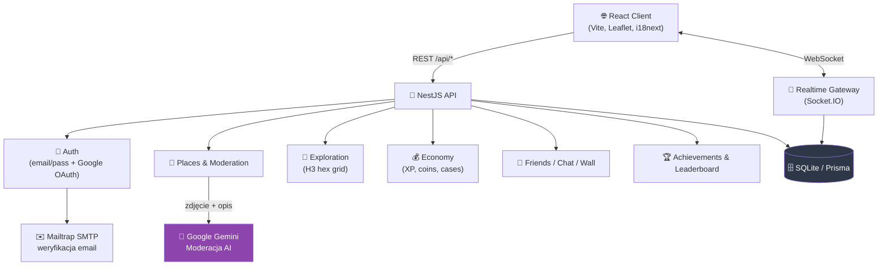

<div align="center">

# 🧭 Absolute Travel

<p><b>Sieć społecznościowa dla podróżników</b> — odkrywaj mapę, zaznaczaj prawdziwe miejsca,<br/>zdobywaj XP i monety, rywalizuj w tabeli liderów i rozmawiaj ze znajomymi w czasie rzeczywistym.</p>


🌐 [Українська](README.md) | 🌐 [English](README.en.md)

</div>

---

## 📌 O projekcie

Absolute Travel to monorepozytorium z **backendem NestJS** oraz **frontendem React + Vite**:
użytkownicy eksplorują stylizowaną mapę heksagonalną (H3), zaznaczają odwiedzone miejsca
z dowodami zdjęciowymi, dodają własne punkty na mapę (z moderacją AI), zdobywają poziomy,
otwierają skrzynie z kosmetykami profilowymi, nawiązują znajomości, rozmawiają w czasie
rzeczywistym i rywalizują w tabeli liderów.

## 🗺️ Architektura



## ✨ Główne Moduły

| Moduł | Opis |
|---|---|
| 🗺️ **Mapa Podróży** | Rzeczywista lokalizacja miejsc (lat/lng), rzutowana na stylizowaną mapę Ukrainy |
| 🤖 **Moderacja AI** | Google Gemini analizuje zdjęcie i opis nowego punktu przed publikacją |
| 🧩 **Eksploracja (H3)** | Postęp odkrywania terytorium za pomocą siatki heksagonalnej H3 |
| 💰 **Ekonomia** | XP, poziomy, monety, skrzynie z kosmetykami do personalizacji profilu |
| 👥 **Społeczność** | Znajomi, czat na żywo (Socket.IO), ściana profilu, znaczniki znajomych na mapie |
| 🏆 **Osiągnięcia / Ranking** | Osiągnięcia i ranking podróżników |
| 🔐 **Autoryzacja** | E-mail + hasło (weryfikacja przez Mailtrap) lub logowanie przez Google |
| 🛡️ **Panel Admina** | Jeden formularz logowania; login admina otwiera panel moderacji i zarządzania adminami |

## 🚀 Szybki start

### 💻 Uruchomienie lokalne (bez Docker)

```bash
# 1. Zainstaluj wszystkie zależności (root + backend + frontend) i przygotuj bazę danych
npm run install:all

# 2. Uruchom frontend i backend jednocześnie
npm run dev
```

### 🐳 Uruchamianie przez Docker

Jeśli chcesz uruchomić projekt w kontenerach:

```bash
# 1. Zbuduj obrazy i uruchom kontenery w tle
docker compose up --build -d

# 2. Sprawdź status kontenerów i healthcheck
docker compose ps

# 3. Zobacz logi
docker compose logs -f

# 4. Zatrzymaj i usuń kontenery
docker compose down
```

> ℹ️ **Domyślne porty:** Frontend będzie dostępny pod adresem [http://localhost:8080](http://localhost:8080), a backend pod adresem [http://localhost:3000](http://localhost:3000). Możesz skonfigurować porty hosta lub przekazać zmienne środowiskowe za pomocą głównego pliku `.env` (używając zmiennych `FRONTEND_PORT` i `BACKEND_PORT`).


<details>
<summary><b>⚙️ Konfiguracja `.env`</b></summary>

Utwórz plik `.env` w katalogu głównym (lub skopiuj z `.env.example`):

```bash
# Klucz API Google Gemini dla doradcy AI i moderacji miejsc
GEMINI_API_KEY=""          # https://aistudio.google.com/apikey
GEMINI_MODEL="gemini-2.5-flash"

# Główne (stałe) konto administratora — zmień w produkcji
ADMIN_LOGIN="admin"
ADMIN_PASSWORD="admin123"

# Google OAuth 2.0 (Logowanie przez Google)
GOOGLE_CLIENT_ID=""
GOOGLE_CLIENT_SECRET=""    # https://console.cloud.google.com/apis/credentials

# SMTP do weryfikacji e-mail (Mailtrap sandbox)
MAILTRAP_USER=""
MAILTRAP_PASS=""           # https://mailtrap.io/
```

> Bez `GEMINI_API_KEY` aplikacja nadal działa: wszystkie zgłoszenia nowych miejsc przez użytkowników otrzymają po prostu status „oczekuje na weryfikację” i będą czekać na ręczną akceptację przez administratora.

</details>

<details>
<summary><b>🗂️ Struktura repozytorium</b></summary>

```
AbsoluteTravel/
├── backend/            # NestJS API (Prisma + SQLite)
│   ├── src/
│   │   ├── auth/         # e-mail/hasło + Google OAuth, weryfikacja e-mail
│   │   ├── places/       # miejsca na mapie + moderacja AI (Gemini)
│   │   ├── exploration/  # postęp na heksagonach H3
│   │   ├── economy/      # XP, monety, skrzynie
│   │   ├── friends/      # zaproszenia do znajomych, znaczniki na mapie
│   │   ├── chat/         # czat w czasie rzeczywistym
│   │   ├── realtime/     # bramka Socket.IO
│   │   ├── achievements/ # osiągnięcia
│   │   ├── leaderboard/  # rankingi graczy
│   │   ├── admin/        # zarządzanie administratorami
│   │   └── wall/         # ściana profilu
│   └── prisma/schema.prisma
└── frontend/           # React 19 + Vite + Leaflet
    └── src/
        ├── ExploreMap.tsx, LeafletMap.tsx   # mapa
        ├── ChatPage.tsx, FriendsPage.tsx     # funkcje społecznościowe
        ├── ProfileShop.tsx, CaseOpener.tsx   # ekonomia
        ├── AdminPanel.tsx                    # panel administratora
        └── exploration/useExploration.ts     # logika H3 po stronie klienta
```

</details>

<details>
<summary><b>🔑 Kto może dodawać miejsca na mapę</b></summary>

- **Każdy użytkownik** — klikając przycisk „Dodaj miejsce” na mapie. Zgłoszenie przechodzi **moderację AI** (Google Gemini z analizą zdjęć): odpowiednie miejsca są publikowane automatycznie, wątpliwe trafiają do ręcznej weryfikacji, a nieodpowiednie są odrzucane. Wymagane są co najmniej 2 zdjęcia i geolokalizacja.
- **Administrator** — specjalne konto z loginem i hasłem: dodaje miejsca bezpośrednio (omijając moderację), zatwierdza/odrzuca/usuwa zgłoszenia oraz **zarządza innymi administratorami** (tworzy i usuwa konta administratorów).

**Jedno logowanie:** formularz logowania jest taki sam dla wszystkich. Zalogowanie się jako administrator przekierowuje do panelu administratora. Zwykli użytkownicy logują się do swojego standardowego interfejsu bez funkcji administratora.

**Konta administratorów:**
- **Główny administrator** — jedyne, stałe konto. Login i hasło są ładowane z pliku `.env` (`ADMIN_LOGIN` / `ADMIN_PASSWORD`) i synchronizowane przy każdym starcie serwera. Nie można go usunąć z poziomu panelu.
- **Zwykli administratorzy** — tworzeni przez dowolnego administratora w sekcji „Administratorzy”. Mają takie same uprawnienia moderacji.

Technicznie rzecz biorąc, logowanie zwraca token sesji (nagłówek `x-admin-token`, zapisywany w przeglądarce). Domyślnie: login `admin`, hasło `admin123`.

</details>

## 🧱 Stos technologiczny

- **Backend:** NestJS 11, Prisma 6 (SQLite), Socket.IO, bcryptjs, Google Auth Library, Nodemailer
- **Frontend:** React 19, Vite, Leaflet, i18next (UA/EN), klient Socket.IO, H3-js
- **AI:** Google Gemini — moderacja nowych miejsc i doradca AI
- **Autoryzacja:** e-mail/hasło z weryfikacją przez Mailtrap + logowanie przez Google

## 📄 Licencja

Projekt jest licencjonowany na warunkach licencji [MIT](LICENSE).
